# Design Patterns

[原文地址](https://dev.to/gopher/go-all-design-patterns-code-with-workflow-ea1)

## Behavioral Patterns

1. [command](./command/main.go)
   

1. [interpreter](./interpreter/main.go)
   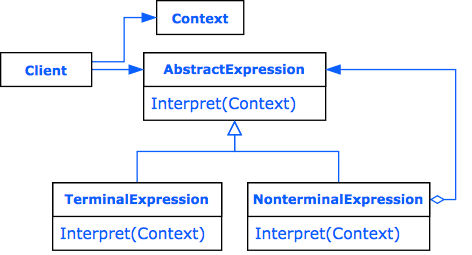

1. [iterator](./iterator/main.go)
   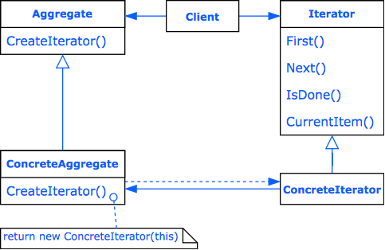

1. [mediator](./mediator/main.go)
   

1. [memento](./memento/main.go)
   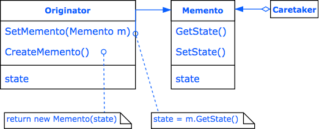

1. [observer](./observer/main.go)
   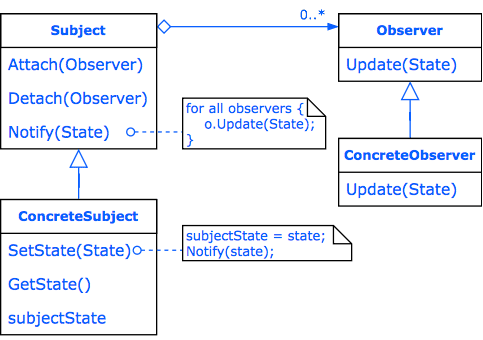

1. [state](./state/main.go)
   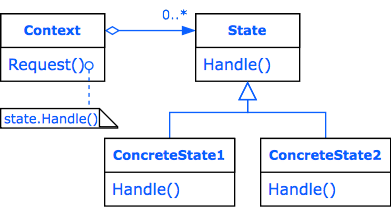

1. [strategy](./strategy/main.go)
   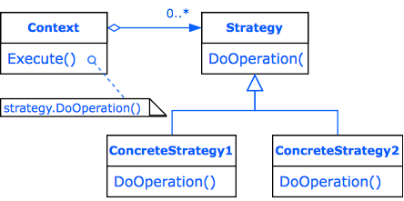

1. [visitor](./visitor/main.go)
   

## Creational Patterns

1. [abstract_factory](./abstract_factory/main.go)
   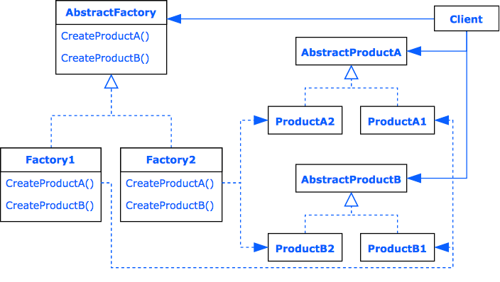

1. [builder](./builder/main.go)
   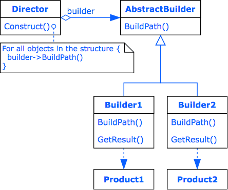

1. [factory_method](./factory_method/main.go)
   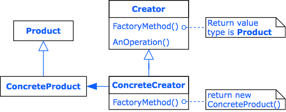

1. [prototype](./prototype/main.go)
   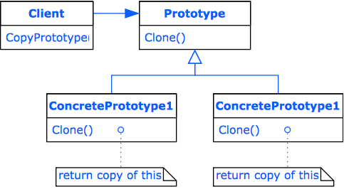

1. [singleton](./singleton/main.go)
   

## Structural Patterns

1. [adapter_composition](./adapter_composition/main.go)
   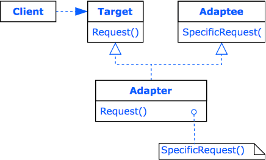

1. [adapter_inheritance](./adapter_inheritance/main.go)
   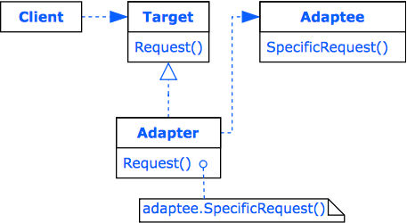

1. [bridge](./bridge/main.go)
   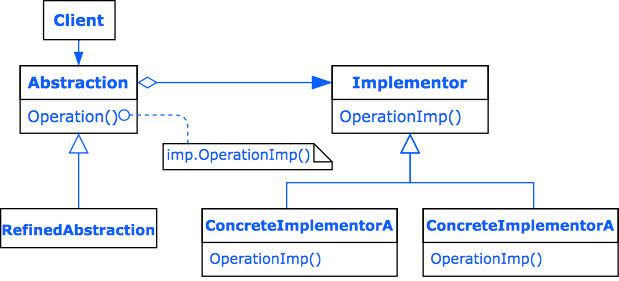

1. [composite](./composite/main.go)
   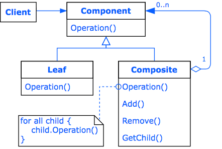

1. [decorator](./decorator/main.go)
   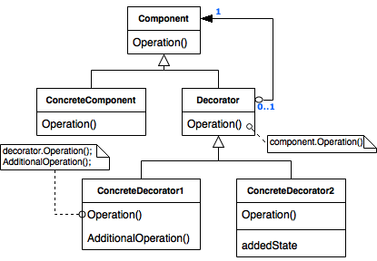

1. [facade](./facade/main.go)
   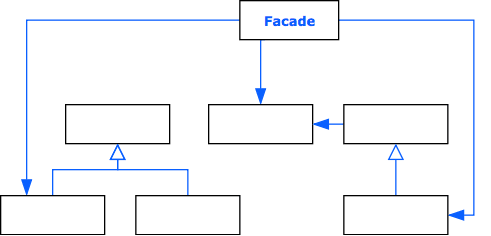

1. [flyweight](./flyweight/main.go)
   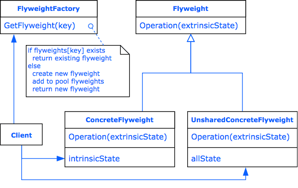

1. [proxy](./proxy/main.go)
   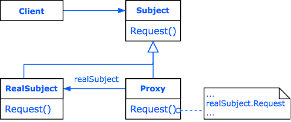
