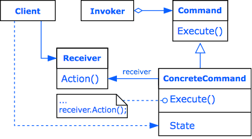

# Design Patterns

[原文地址](https://dev.to/gopher/go-all-design-patterns-code-with-workflow-ea1)

1. [Command](./command/main.go)
   

1. [Interpreter](./interpreter/main.go)
   

1. [Iterator](./iterator/main.go)
   
