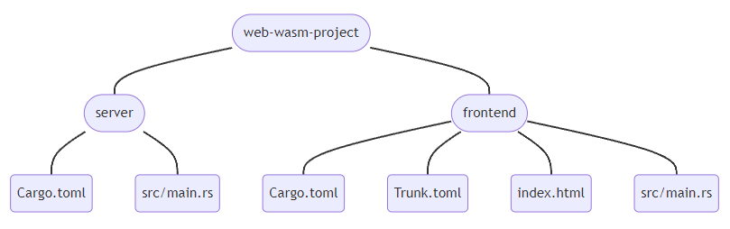

# Web WASM Demo

[原文地址](https://robert.kra.hn/posts/2022-04-03_rust-web-wasm/)

## 工具

- Rust wasm32 target：`rustup target add wasm32-unknown-unknown`

- [Trunk](https://trunkrs.dev/)：Rust 版本的 WASM 打包工具

- [cargo-edit](https://github.com/killercup/cargo-edit)：`cargo install cargo-edit`

- [cargo-watch](https://watchexec.github.io/#cargo-watch)：`cargo install cargo-watch`

## 项目

- 项目结构:



- 初始化：

```sh
mkdir web-wasm-demo
cd web-wasm-demo
cargo new --bin server --vcs none
cargo new --bin frontend --vcs none
echo -e "target/\n/dist/" > .gitignore
git init
```

- 服务端依赖：

```toml
axum
axum-extra
clap
log
serde
serde_json
tokio
tower
tower-http
tracing
tracing-subscriber
```

- 前端依赖：

```toml
console_error_panic_hook
gloo-net
log
wasm-bindgen-futures
wasm-logger
yew
yew-router
```

## 部署

执行 `cd server; cargo build --release` 后，移动 `server/target/release/server` 以及 `dist/` 到同一路径下，然后执行 `server -static-dir ./dist`。
